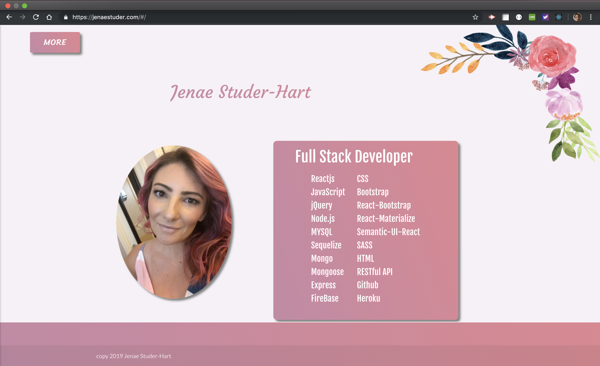
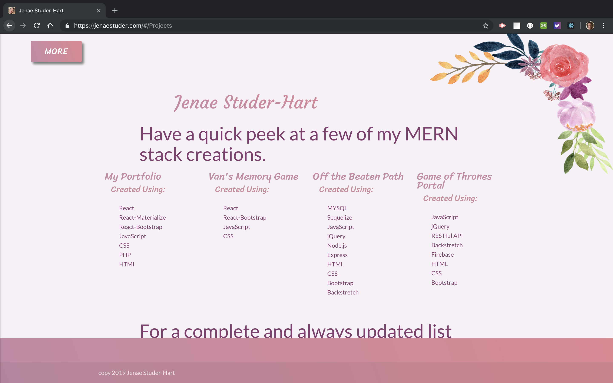

# Professional-Portfolio

https://jenaestuder.com

## My portfolio was created using Reactjs, React-Bootstrap, React-Materialize, CSS, JavaScript, Node.js, Express and is hosting utilizing Github Pages with a React Router to allow it to be a single page application with the functionality of a multi-page application.

### Home Page

### Home Page with React-Materialize SideNav Component that utilizes the React Router to move to other pages along with quick links to my Github and LinkedIn Pages.

### Home Page in mobile for iPhone X

### Projects Page displays a few links to my projects and also contains a link to my Github.

### Projects Page in mobile view for an iPhone X

### Contact Page which utilizes the React-Materialize form component

### Contact Page in mobile view for an iPhone X

### React-Materialize Sidebar Nav in mobile view for an iPhone X

